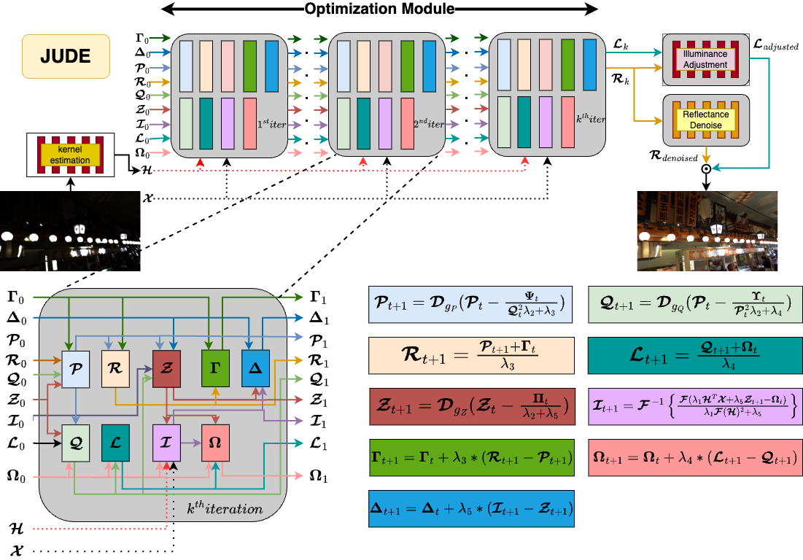

# JUDE Deep Joint Unrolling for Deblurring and Low-Light Image Enhancement

by [Tu Vo](https://tuvovan.github.io) and Chan Y. Park

## Introduction
We introduce JUDE, a Deep Joint Unrolling for Deblurring and Low-Light Image Enhancement, inspired by the image physical model. Based on Retinex theory and the blurring model, the low-light blurry input is iteratively deblurred and decomposed, producing sharp low-light reflectance and illuminance through an unrolling mechanism. Additionally, we incorporate various modules to estimate the initial blur kernel, enhance brightness, and eliminate noise in the final image. Comprehensive experiments on LOL-Blur and Real-LOL-Blur demonstrate that our method outperforms existing techniques both quantitatively and qualitatively.
Check our [paper](https://arxiv.org/pdf/2412.07527) for more details.



### Prerequisites

- Pytorch

## Datasets
- LOL-Blur [Link](https://drive.google.com/drive/folders/11HcsiHNvM7JUlbuHIniREdQ2peDUhtwX)
- Real LOL-Blur [Link](https://drive.google.com/drive/folders/1fXUA5SzXj46ISw9aUjSors1u6M9VlKAn)

## Pretrained Models
[Link](https://drive.google.com/file/d/1SS6JO8J6gJ8pbGSNhkLQ2ZoQpzEOR0Vw/view?usp=sharing)
## Running
### Training 
...tobeupdated...

### Testing
- Download the weight and put it to the folder ```model_zoo/BOWNet_kernel_prediction_model_v10-5-512-ResUNet```
- Check the `options/train.yml` file and modify appropriately. 
- Run: `python test.py`

## Result
### Benchmarking the LOL-Blur Dataset.
| Model Name                  | PSNR ↑ | SSIM ↑ | LPIPS ↓ |
|-----------------------------|--------|--------|---------|
| FourLLIE → FFTFormer        | 18.433 | 0.705  | 0.305   |
| LLFormer → FFTFormer        | 20.290 | 0.792  | 0.212   |
| RetinexFormer → FFTFormer   | 16.452 | 0.702  | 0.324   |
| MIMO → RetinexFormer        | 17.024 | 0.770  | 0.271   |
| FFTFormer → RetinexFormer   | 16.712 | 0.728  | 0.325   |
| FFTFormer                  | 19.889 | 0.858  | 0.139   |
| RetinexFormer              | 25.505 | 0.862  | 0.240   |
| LEDNet                     | 25.740 | 0.850  | 0.224   |
| FELI                       | 26.728 | 0.914  | 0.132   |
| **JUDE**                   | **26.884** | **0.932** | **0.127** |

### Benchmarking the Real-Blur Dataset.
| Model Name                  | ARNIQA ↑ | CONTRIQUE ↑ | LIQE ↑ | MUSIQ ↑ | CLIPIQA ↑ | DBCNN ↑ |
|-----------------------------|----------|-------------|--------|---------|-----------|---------|
| FourLLIE → FFTFormer        | 0.307    | 46.823      | 1.113  | 30.840  | 0.217     | 0.261   |
| LLFormer → FFTFormer        | 0.401    | 44.743      | 1.158  | 36.534  | 0.208     | 0.257   |
| RetinexFormer → FFTFormer   | 0.364    | 41.495      | 1.075  | 34.793  | 0.227     | 0.279   |
| MIMO → RetinexFormer        | 0.413    | 40.773      | 1.137  | 33.242  | 0.207     | 0.276   |
| FFTFormer → RetinexFormer   | 0.405    | 48.814      | 1.195  | 35.511  | 0.221     | 0.303   |
| FFTFormer                  | 0.402    | 38.005      | 1.141  | 32.079  | 0.289     | 0.307   |
| RetinexFormer              | 0.418    | 43.410      | 1.074  | 31.782  | 0.187     | 0.232   |
| LEDNet                     | 0.419    | 49.828      | 1.414  | 43.623  | 0.281     | 0.306   |
| FELI                       | 0.429    | 42.354      | 1.155  | 33.669  | 0.207     | 0.239   |
| **JUDE**                   | **0.437** | **50.207**  | **1.454** | **44.732** | **0.299** | **0.313** |

## License

This project is licensed under the MIT License - see the [LICENSE](https://github.com/tuvovan/ATTSF/blob/master/LICENSE) file for details

## Citation
```
@article{tvo_jude,
  author    = {Tu Vo and Chan Y. Park},
  title     = {Deep Joint Unrolling for Deblurring and Low-Light Image Enhancement (JUDE)},
  booktitle = {The IEEE/CVF Winter Conference on Applications of Computer Vision},
  year      = {2025}
}
```

## Contact
If you have any questions, please contact [tuvv@kc-ml2.com](mailto:tuvv@kc-ml2.com)